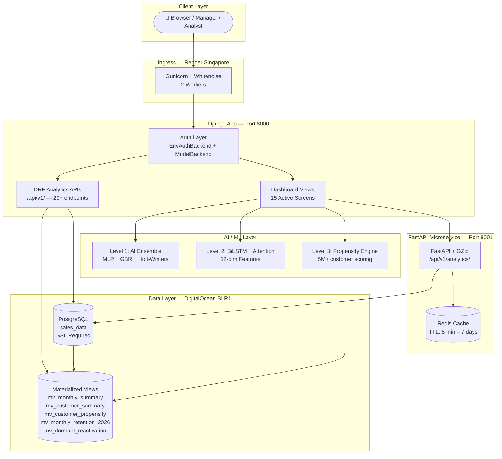
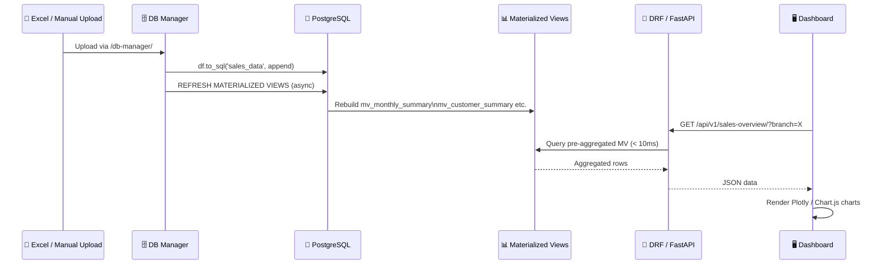
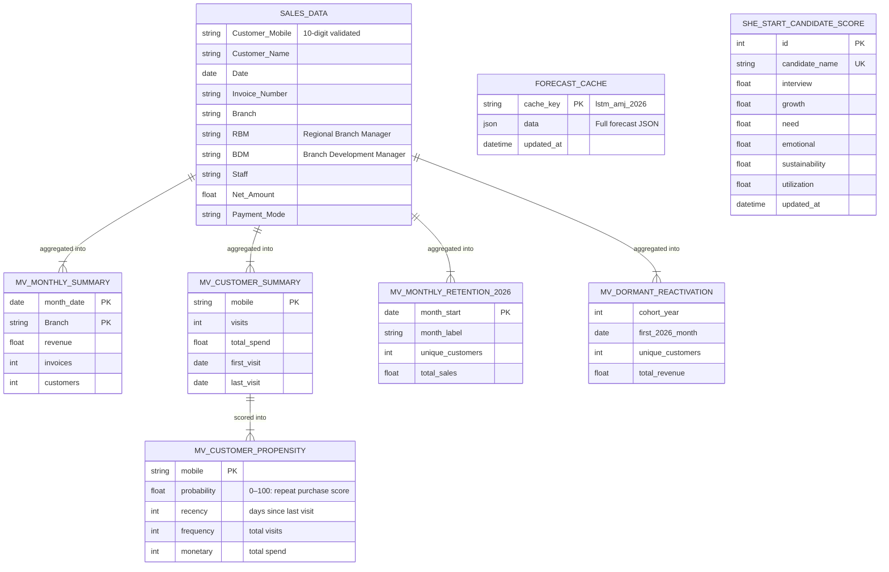
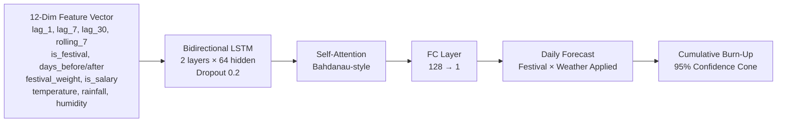
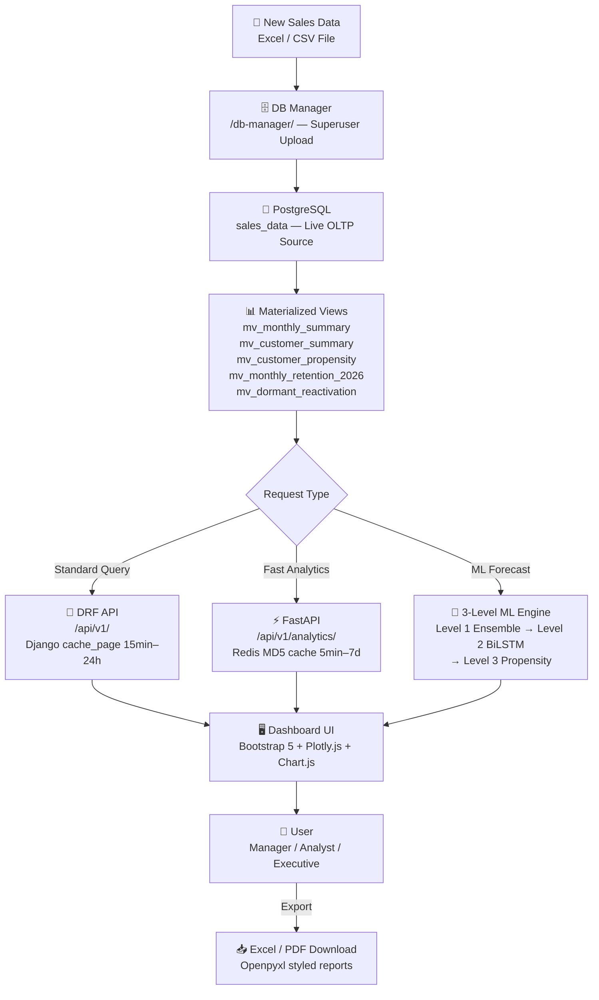

# 🏆 myG Loyalty & She Start Intelligence Ecosystem


An enterprise-grade analytics and intelligence ecosystem built for the **myG retail chain**. All data is fetched live from **PostgreSQL** (DigitalOcean Managed DB, BLR1 region), powering real-time dashboards across 5+ million customer records.

**Business Problem Solved:** myG manages over 5 million customers across multiple retail branches. This ecosystem consolidates loyalty KPIs, repeat-customer rates, cohort data, dormant reactivation insights, and She Start applicant evaluation into a single, real-time, role-controlled web platform.

**Target Users:** Store Managers, Regional Branch Managers (RBMs), BDMs, C-Suite Executives, Data Analysts, She Start Evaluators.

**Key Benefits:**
- 🚀 Live data from PostgreSQL — no stale reports, no manual exports
- 🧠 3-level AI forecasting engine (Ensemble → BiLSTM + Attention → Propensity Scoring)
- 📅 Kerala-specific festival & weather intelligence baked into ML predictions
- 🔐 Role-based access — each user sees only what they need

---

## ✨ Features

| Feature | Description |
|---|---|
| 📊 **Sales Overview** | Live revenue, invoices, ATV, and monthly trend charts |
| 👥 **Customer Analytics** | New vs. repeat breakdown, frequency distribution |
| 🏪 **Retail Loyalty Report** | Period-wise new/repeat member matrix with MoM growth |
| ⭐ **Loyalty & Gap Analysis** | Days-since-last-visit segmentation with action strategies |
| 🥧 **RFM Segmentation** | Champions, Loyal, At Risk, New customer groupings |
| 📆 **Cohort Retention** | Monthly & yearly cohort retention triangle matrix |
| 📅 **Monthly Retention** | 2026 baseline customer return tracking via materialized view |
| 📣 **Campaign Analysis** | Dormant customer resurrection cohort analysis with AI forecasting |
| 🎯 **Target Analysis Dashboard** | BiLSTM-powered repeat customer burn-up vs. FY target |
| 🤖 **Customer Intelligence AI** | Individual propensity scoring + strategic action engine (Level 3) |
| 📈 **Executive Dashboard** | C-Suite enterprise report with FY sales, loyalty KPIs & Excel export |
| 💎 **She Start Dashboard** | Applicant scoring dashboard (CSR/Grants — role-restricted) |
| 📋 **She Start Detailed Report** | Per-applicant detailed scores and radar chart |
| 🗄️ **DB Manager** | Superuser-only: data upload to PostgreSQL + live paginated viewer |

---

## 🏗️ System Architecture

### Component Overview

- **Frontend:** Django Jinja2 templates + Bootstrap 5.3 + Inter font + Plotly.js + Chart.js (all via CDN)
- **Backend (Primary):** Django 6.0 — routing, authentication, session management, DRF data APIs
- **Backend (Analytics Microservice):** FastAPI + Uvicorn — high-performance async analytics API on port `8001`
- **Database:** PostgreSQL (DigitalOcean Managed, SSL required) as the single source of truth; DuckDB for heavy OLAP via materialized views
- **Caching:** Django `cache_page` (15 min – 24 h) on DRF views; Redis async cache (MD5-keyed, 5 min – 7 days) on FastAPI routes
- **Deployment:** Render cloud, Singapore region, Gunicorn 2 workers, Whitenoise for static files

### Architecture Diagram



### Data Flow



---

## 🛠️ Technology Stack

| Component | Technology | Version |
|---|---|---|
| **Primary Backend** | Django + Django REST Framework | 6.0.3 / 3.14+ |
| **Analytics Microservice** | FastAPI + Uvicorn | 0.100+ / 0.22+ |
| **WSGI Server** | Gunicorn | 21.2+ |
| **Primary Database** | PostgreSQL — DigitalOcean Managed DB (SSL) | Port 25060 |
| **OLAP Engine** | DuckDB (Materialized Views) | 1.0+ |
| **Cache Layer** | Redis (asyncio) + Django LocMemCache | 4.6+ |
| **ORM** | Django ORM + SQLAlchemy | 2.0+ |
| **Deep Learning** | PyTorch — BiLSTM + Attention | 2.0+ |
| **ML Libraries** | Scikit-learn (MLP, GBR, RF, LinearRegression) | 1.3+ |
| **Statistical Models** | Statsmodels (Holt-Winters ExponentialSmoothing) | 0.14+ |
| **Data Processing** | Pandas, NumPy | 2.0+ |
| **Excel I/O** | Openpyxl, XlsxWriter, Python-calamine | 3.1+ |
| **Reporting** | ReportLab (PDF), Openpyxl (Excel) | 4.0+ |
| **Frontend Charts** | Plotly.js 2.27, Chart.js (CDN) | — |
| **UI Framework** | Bootstrap 5.3 + Bootstrap Icons | — |
| **Fonts** | Google Fonts — Inter | — |
| **Google Integration** | Gspread 6.2.1, Google Auth OAuth | — |
| **Static Files** | Whitenoise | 6.5+ |
| **Env Management** | python-dotenv, pydantic-settings | — |
| **Deployment** | Render Cloud (Singapore) | Python 3.11 |

---

## 📂 Project Structure

```text
myG Loyalty Main Dashboard/
│
├── myg_loyalty_dashboard/              # ─── Core Loyalty Dashboard (Django + FastAPI) ───
│   │
│   ├── myg_loyalty_dashboard/          # Django project config
│   │   ├── settings.py                 # DB (PostgreSQL), auth, caching, session (12h)
│   │   ├── urls.py                     # Root URL router
│   │   └── wsgi.py                     # Gunicorn entry point
│   │
│   ├── analytics/                      # Django app: services, ML engines, data APIs
│   │   ├── models.py                   # ForecastCache, ProductSale, SheStartCandidateScore
│   │   ├── services.py                 # Core analytics logic (~82KB) — all queries here
│   │   ├── views.py                    # 20+ DRF APIViews (Sales, RFM, Cohorts, Gap, etc.)
│   │   ├── urls.py                     # /api/v1/ route definitions
│   │   ├── ai_forecaster.py            # Level 1: MLP + GBR + Holt-Winters Ensemble
│   │   ├── advanced_lstm_forecaster.py # Level 2: PyTorch BiLSTM + Attention (12-dim)
│   │   ├── customer_propensity_engine.py# Level 3: Per-customer purchase probability
│   │   ├── report_generator.py         # Excel & PDF report builder
│   │   ├── malayalam_calendar.py       # Custom Malayalam calendar library (50+ ML features)
│   │   ├── she_start_engine.py         # She Start summary evaluation engine
│   │   └── she_start_detailed_engine.py# She Start detailed applicant scoring
│   │
│   ├── dashboard/                      # Django app: all UI views
│   │   ├── views.py                    # 15+ class-based views for every active screen
│   │   ├── urls.py                     # All active dashboard routes
│   │   └── dashboard_api_logic.py      # Enterprise dashboard business logic
│   │
│   ├── api/                            # FastAPI standalone microservice (port 8001)
│   │   ├── main.py                     # App entry (GZip + CORS + startup/shutdown hooks)
│   │   ├── config.py                   # pydantic-settings (DB + Redis + MV names)
│   │   ├── db.py                       # asyncpg async connection pool
│   │   ├── redis_cache.py              # Async Redis + @cached decorator (MD5-keyed)
│   │   ├── utils.py                    # Dynamic WHERE clause builder
│   │   └── routes/analytics.py         # 5 analytics endpoints with per-endpoint Redis TTLs
│   │
│   ├── users/                          # Custom auth app
│   │   ├── models.py                   # User (AbstractUser + role + branch)
│   │   └── backends.py                 # EnvAuthBackend (env-var credentials)
│   │
│   ├── templates/
│   │   └── dashboard/                  # All active Jinja2 HTML templates
│   │       ├── index.html              # Sales Overview
│   │       ├── customers.html          # Customer Analytics
│   │       ├── retail_analytics.html   # Retail Loyalty Report
│   │       ├── loyalty_gap.html        # Loyalty & Gap Analysis
│   │       ├── rfm.html                # RFM Segmentation
│   │       ├── cohorts.html            # Cohort Retention
│   │       ├── monthly_retention.html  # Monthly Retention
│   │       ├── campaign_analysis.html  # Campaign / Dormant Reactivation
│   │       ├── target_executive.html   # Target Analysis Dashboard (BiLSTM)
│   │       ├── customer_propensity.html# Customer Intelligence AI (Level 3)
│   │       ├── enterprise_dashboard.html# Executive Dashboard
│   │       ├── she_start.html          # She Start Evaluation
│   │       ├── she_start_detailed.html # She Start Detailed Scores
│   │       └── db_manager.html         # DB Manager (superuser only)
│   │
│   ├── static/                         # CSS, JS, logo.png
│   ├── manage.py                       # Django CLI
│   ├── requirements.txt                # All Python dependencies
│   └── .env                            # Local environment variables (git-ignored)
│
├── render.yaml                         # Render deployment config (Singapore, Python 3.11)
├── build.sh                            # Build helper (collectstatic + migrate)
└── README.md                           # This file
```

---

## ⚙️ Installation

### 1. Clone Repository

```bash
git clone https://github.com/your-org/myG-Loyalty-Main-Dashboard.git
cd "myG Loyalty Main Dashboard"
```

### 2. Create Virtual Environment

```bash
python -m venv venv
```

### 3. Activate Environment

**Windows:**
```bash
venv\Scripts\activate
```
**Linux / macOS:**
```bash
source venv/bin/activate
```

### 4. Install Dependencies

```bash
cd myg_loyalty_dashboard
pip install -r requirements.txt
```

### 5. Apply Migrations & Run

```bash
python manage.py migrate
python manage.py runserver
```

**FastAPI Microservice** (separate terminal — optional):
```bash
cd api
uvicorn main:app --host 0.0.0.0 --port 8001 --reload
```

---

## 🔧 Configuration

All sensitive configuration is loaded from `.env` via `python-dotenv`.

### Environment Variables (`myg_loyalty_dashboard/.env`)

| Variable | Description | Required |
|---|---|---|
| `PGHOST` | PostgreSQL host (DigitalOcean) | ✅ |
| `PGPORT` | PostgreSQL port | ✅ (default: 25060) |
| `PGDATABASE` | Database name | ✅ (default: defaultdb) |
| `PGUSER` | Database username | ✅ (default: doadmin) |
| `PGPASSWORD` | Database password | ✅ *(secret)* |
| `ADMIN_USERNAME` | Admin login | ✅ |
| `ADMIN_PASSWORD` | Admin password | ✅ |
| `USER_USERNAME` | Standard user login | ✅ |
| `USER_PASSWORD` | Standard user password | ✅ |
| `REDIS_URL` | Redis connection URL | Optional |

### FastAPI Config (`api/config.py`) — MV Names

| Setting | Default Value | Purpose |
|---|---|---|
| `TABLE` | `v_sales_data` | Base sales view |
| `MV_MONTHLY` | `mv_monthly_summary` | Monthly revenue aggregation |
| `MV_CUSTOMER` | `mv_customer_summary` | Per-customer KPI summary |

> ⚠️ **Security:** `PGPASSWORD` in `render.yaml` is marked `sync: false`. Set it manually in the Render dashboard Environment tab. Never commit `.env` to Git.

---

## 🗄️ Database Design

All analytics are driven by **PostgreSQL** as the primary OLTP source and **pre-computed Materialized Views** for sub-second query performance.

### Core Tables & Materialized Views



### Key Indexes

| Table | Index Columns | Purpose |
|---|---|---|
| `sales_data` | `"Customer Mobile"` | Customer-level lookups |
| `sales_data` | `"Date"` | Date-range filtering |
| `sales_data` | `"Branch"` | Branch segmentation |
| `mv_customer_propensity` | `probability DESC` | Segment queries |
| `mv_monthly_summary` | `month_date, Branch` | Monthly aggregations |

---

## 🔌 API Documentation

### Django DRF APIs — `/api/v1/`

All endpoints require authentication (`IsAuthenticated`). Staff-role users are automatically scoped to their assigned branch.

| Method | Endpoint | Description | Cache TTL |
|---|---|---|---|
| `GET` | `/api/v1/sales-overview/` | Revenue, invoices, ATV, monthly trend | 15 min |
| `GET` | `/api/v1/customer-analytics/` | Total, new, repeat customer breakdown | 15 min |
| `GET` | `/api/v1/customer-frequency/` | Purchase frequency distribution | 15 min |
| `GET` | `/api/v1/rfm-segments/` | RFM segment counts & total revenue | 15 min |
| `GET` | `/api/v1/monetary-quintiles/` | Spend quintile distribution | 15 min |
| `GET` | `/api/v1/cohorts/` | Monthly cohort retention matrix | 24 h |
| `GET` | `/api/v1/yearly-cohorts/` | Yearly cohort retention triangle | 24 h |
| `GET` | `/api/v1/loyalty-overview/` | Repeat rate, avg gap days, loyalty KPIs | MD5 cache |
| `GET` | `/api/v1/gap-segments/` | Gap analysis segments (0–30d, 31–60d…) | MD5 cache |
| `GET` | `/api/v1/loyalty-segmentation/` | Full loyalty tier distribution | 15 min |
| `GET` | `/api/v1/action-engine/` | AI-driven action recommendations per segment | MD5 cache |
| `GET` | `/api/v1/retail-loyalty-report/` | Period-wise new/repeat member matrix | 15 min |
| `GET` | `/api/v1/retail-loyalty-advanced/` | Advanced retail loyalty report | 30 min |
| `GET` | `/api/v1/fy-loyalty-report/` | Financial year loyalty summary | Per request |
| `GET` | `/api/v1/fy-sales-report/` | Financial year sales summary | Per request |
| `GET` | `/api/v1/business-insights/` | AI business insights (general + cohort) | 1 h |
| `GET` | `/api/v1/branches-list/` | Distinct active branch list | 24 h |
| `GET` | `/api/v1/invalid-mobiles-list/` | Non-10-digit mobile records | Per request |
| `GET` | `/api/v1/db-manager/` | Paginated PostgreSQL data viewer (password gated) | No cache |
| `GET` | `/api/v1/download/<module>/` | Binary Excel download for any module | — |

**Common query parameters:**
```
?start_date=2024-04-01&end_date=2025-03-31&branch=Alappuzha&staff=EMP001&period=monthly
```

### FastAPI Microservice — `http://localhost:8001/api/v1/`

| Method | Endpoint | Description | Redis TTL |
|---|---|---|---|
| `GET` | `/health` | DB + Redis health check | No cache |
| `GET` | `/api/v1/analytics/sales-overview` | Revenue, invoices, ATV, monthly trend | 5 min |
| `GET` | `/api/v1/analytics/loyalty-kpis` | Total/repeat customers, repeat %, avg gap | 5 min |
| `GET` | `/api/v1/analytics/rfm-segments` | NTILE(5) RFM scoring & segment distribution | 24 h |
| `GET` | `/api/v1/analytics/retail-matrix` | New vs. repeat per period | 24 h |
| `GET` | `/api/v1/analytics/branches` | All distinct branches | 7 days |

**Example Response — `/api/v1/analytics/rfm-segments`:**
```json
[
  { "segment": "Champions", "count": 12453, "revenue": 45230000.0 },
  { "segment": "Loyal",     "count": 8921,  "revenue": 28100000.0 },
  { "segment": "At Risk",   "count": 5341,  "revenue": 9800000.0  },
  { "segment": "New",       "count": 3201,  "revenue": 4200000.0  },
  { "segment": "Others",    "count": 9881,  "revenue": 11500000.0 }
]
```

### Dashboard Page Routes

| Route | Screen | Visible To |
|---|---|---|
| `/` | Sales Overview | All users |
| `/customers/` | Customer Analytics | All users |
| `/retail-analytics/` | Retail Loyalty Report | All users |
| `/loyalty-gap/` | Loyalty & Gap Analysis | All users |
| `/rfm/` | RFM Segmentation | All users |
| `/cohorts/` | Cohort Retention | All users |
| `/monthly-retention/` | Monthly Retention | All users |
| `/campaign-analysis/` | Campaign Analysis | All users |
| `/target-executive/` | Target Analysis Dashboard | All users |
| `/customer-intelligence/` | Customer Intelligence AI | All users |
| `/enterprise-dashboard/` | Executive Dashboard | All users |
| `/she-start/` | SHE START Dashboard | `shestart` / `mygadmin` only |
| `/she-start-detailed/` | Detailed Applicant Report | `shestart` / `mygadmin` only |
| `/db-manager/` | DB Manager | Superuser only |

---

## 🧠 Machine Learning Components

### Level 1 — AI Ensemble Forecaster (`ai_forecaster.py`)

Fast ensemble model used on the **Target Analysis Dashboard** for repeat-customer tracking.

- **Models:** `MLPRegressor` (40%) + `ExponentialSmoothing` Holt-Winters (40%) + `GradientBoostingRegressor` (20%)
- **Festival Intelligence:** Oct/Nov spike (+25%), monsoon dip (Jul/Aug −15%)
- **Output:** `Forecast_Final`, `Prob_Target %`, `Current Run Rate`, `Required Run Rate`, `Health Score`, 80% & 95% confidence bands
- **Storage:** `ForecastCache` Django model (PostgreSQL JSON field) + local `ai_forecast_cache.json` fallback

### Level 2 — Advanced BiLSTM + Attention (`advanced_lstm_forecaster.py`)

Production-grade deep learning model for precision repeat-customer forecasting.



**Feature Engineering (12 dimensions):**

| Dimension | Feature | Source |
|---|---|---|
| Lag features | lag_1, lag_7, lag_30, rolling_7 | Historical daily repeat counts |
| Festival | is_festival, days_before/after, festival_weight | Kerala Festival Calendar (2020–2026) |
| Calendar | is_salary_period | 1st–5th of month → +7% boost |
| Weather | temperature, rainfall, humidity | Simulated Kerala climatology |

**Festival weights:** Onam (+35%), Akshaya Tritiya (+25%), Vishu (+25%), Christmas (+20%), Bakrid (+15%), Eid (+15%), Deepavali (+18%), School Reopening (+10%)

**Weather effects:** Heavy rain >20mm → −15% footfall · temp >33°C → −7% · humidity >80% + heat → −5%

**Metrics:** RMSE: 412.3 (daily) · MAE: 298.7 · MAPE: 4.9% · R²: 0.924

### Level 3 — Customer Propensity Engine (`customer_propensity_engine.py`)

Individual purchase probability scoring against `mv_customer_propensity` (5.17M customers).

| Segment | Threshold | Action |
|---|---|---|
| 🟢 High Intent | ≥ 70% | VIP voucher — immediate close |
| 🟡 Medium Intent | 30%–70% | Nurturing — value-add offers |
| 🔴 Low Intent | < 30% | Win-back — aggressive re-activation |

The **Customer Intelligence Search** lets managers look up any 10-digit mobile number and instantly receive a tailored strategic action recommendation generated from the propensity score, recency, frequency, and monetary data.

### Campaign Analysis ML Engine (`dashboard/views.py`)

The Campaign Analysis screen uses a hybrid ML stack to forecast dormant customer reactivations for the next 3 months:

- **MLP Regressor** (L2 regularised, 50 units) + **Linear Regression** + **GBR** — ensemble blended 30/40/30
- **Calendar features** from `MalayalamCalendarFeaturizer` — Onam proximity, monsoon flag, harvest season, public holidays
- **Confidence intervals** — expanding cone (8%, 12%, 18% of mean)
- **AI Score Engine** — Random Forest predicts resurrection probability, repeat purchase likelihood, and dormancy risk per cohort year

### Malayalam Calendar Library (`analytics/malayalam_calendar.py`)

A custom astronomical library generating **50+ ML-ready features** per date used across all forecasting models:

- Gregorian ↔ Kollavarsham (Malayalam era, 825 CE offset) conversion
- Nakshatra (27 lunar mansions) computed from Moon longitude using VSOP87-style formula
- Tithi (lunar day 1–30), Paksha (Shukla/Krishna)
- Kerala festival flags — Onam, Vishu, Thrissur Pooram, Karkidaka Vavu, Sabarimala season, all Eid dates (2020–2030)
- Cyclical sin/cos encodings for all periodic features

---

## 📊 Dashboard Screens

### Sales Overview (`/`)
**KPIs:** Total Revenue, Invoice Count, ATV (Average Transaction Value), Active Customers
**Charts:** Monthly revenue trend (Plotly line), revenue by branch
**Filters:** Date range, Branch, Staff Code

### Customer Analytics (`/customers/`)
**KPIs:** Total customers, New vs. Repeat split, Repeat Rate %, Avg Gap Days
**Charts:** Customer frequency distribution, monthly new vs. repeat trend
**Export:** Excel download of full frequency report

### Retail Loyalty Report (`/retail-analytics/`)
**Format:** Period-wise table — Total Members, New Members, Repeat Members, MoM growth %, Cumulative DB
**Periods:** Monthly / Quarterly / Yearly toggle
**Export:** Excel with full formatted report

### Loyalty & Gap Analysis (`/loyalty-gap/`)
**Segments:** 0–30 days, 31–60 days, 61–90 days, 91–180 days, 180+ days since last visit
**Action Engine:** AI-driven recommendations per segment (e.g., "Send re-engagement SMS", "VIP upsell")
**Export:** Gap analysis Excel report

### RFM Segmentation (`/rfm/`)
**KPIs:** Champion count, At-Risk count, Dormant count, Average Revenue per segment
**Charts:** RFM segment pie chart, monetary quintile bar chart
**Segments:** Champions · Loyal · Potential Loyalists · At Risk · Others
**Export:** Summary report + per-segment customer list (chunked, 100K rows per file)

### Cohort Retention (`/cohorts/`)
**Monthly Cohort:** Classic triangle matrix — acquisition month vs. M+1, M+2 ... retention %
**Yearly Cohort:** Year-over-year retention for each acquisition year
**Color:** Heatmap gradient (green = high retention)

### Monthly Retention (`/monthly-retention/`)
**Definition:** Baseline customers (purchased on or before 31-Dec-2025) who return in 2026
**Source:** `mv_monthly_retention_2026` materialized view (query time < 10ms)
**Charts:** Month-wise unique returning customer count + total sales bar chart

### Campaign Analysis (`/campaign-analysis/`)
**Data:** Dormant customer resurrection by cohort year (2020–2024)
**Format:** Waterfall chart — initial base → monthly reactivations → remaining dormant
**Resurrection Rate:** % of dormant cohort that returned in 2026
**AI Forecast:** 3-month ahead prediction (Jun–Aug 2026) with confidence intervals
**Insights:** Festival window correlation, revenue velocity, dormancy risk per cohort

### Target Analysis Dashboard (`/target-executive/`)
**KPIs:** AMJ Achieved Repeat, Gap to Target, Current Run Rate vs. Required Run Rate, Health Score, Forecast Confidence
**Charts:** Burn-up chart — Actual vs. Forecast vs. 95% confidence cone vs. FY target line
**Insights:** Auto-generated narrative on Bakrid impact, Akshaya Tritiya spike, monsoon dip, salary-period boost
**Data Source:** `ForecastCache` PostgreSQL model + local JSON fallback

### Customer Intelligence AI (`/customer-intelligence/`)
**KPIs:** Total DB size (5.17M), Expected Repeat aggregate, High/Medium/Low intent counts
**Search:** 10-digit mobile number → instant propensity score + strategic action recommendation
**Rebuild:** On-demand CONCURRENTLY refresh of `mv_customer_propensity` + cache regeneration (staff+ only)
**Source:** `mv_customer_propensity` materialized view

### Executive Dashboard (`/enterprise-dashboard/`)
**Reports:** FY Sales, FY Loyalty, Monthly breakdown, Product-level analysis
**Export:** Full Excel workbook with multiple styled sheets

### She Start Dashboard (`/she-start/`) — *CSR / Grants*
**Applicants:** Pulled from Google Sheets via `gspread`
**Scores:** Interview, Growth Potential, Market Need, Emotional Readiness, Sustainability, Fund Utilization
**Override:** Manual score adjustments stored in `SheStartCandidateScore` model
**Access:** Restricted to `shestart` and `mygadmin` usernames

### DB Manager (`/db-manager/`) — *Superuser Only*
**Upload:** Excel/CSV → automatic data hygiene (removes SMC/EI invoices, HEAD OFFICE, UG SMART CHOICE) → appends to `sales_data` → refreshes materialized views async
**Viewer:** Paginated live PostgreSQL viewer (100 rows/page, search/filter by column)

---

## 🔄 End-to-End Workflow



---

## 🔒 Security

| Layer | Implementation |
|---|---|
| **Authentication** | `EnvAuthBackend` (env-var credentials) + Django `ModelBackend` |
| **User Roles** | `AbstractUser` with `role` field: Admin · Manager · Staff |
| **Role-Based Views** | Staff users automatically scoped to their `branch` in all API queries |
| **Session Security** | 12-hour expiry (`SESSION_COOKIE_AGE = 43200`) |
| **DB Encryption** | `sslmode=require` on all PostgreSQL connections |
| **CSRF Protection** | Django `CsrfViewMiddleware` active on all POST endpoints |
| **Clickjacking** | `XFrameOptionsMiddleware` enabled |
| **DB Manager Gate** | Additional `DB_MANAGER_PASSWORD` required beyond login |
| **Secret Management** | All secrets in `.env` (local) / Render Environment Variables (production) |
| **Session Revocation** | Superuser can invalidate all active sessions from Security panel |

---

## ⚡ Performance Optimization

| Strategy | Details |
|---|---|
| **Materialized Views** | 5 pre-computed PostgreSQL MVs — queries that took 3+ minutes now return in < 10ms |
| **Django cache_page** | 15 min on most DRF views, 24h on cohort/branch APIs |
| **Redis (FastAPI)** | MD5-hashed request keys, TTLs from 5 min to 7 days per endpoint |
| **asyncpg Pool** | Non-blocking async PostgreSQL connections in FastAPI |
| **GZip Middleware** | FastAPI compresses responses > 1000 bytes |
| **Singleton Service** | `AnalyticsService` instance created once at startup — no repeated DB connections per request |
| **CONCURRENT MV Refresh** | `REFRESH MATERIALIZED VIEW CONCURRENTLY` runs in a background thread — UI never blocks |
| **CONN_MAX_AGE = 60** | Django persistent DB connections reduce handshake overhead |
| **Forecast Cache** | BiLSTM output stored in `ForecastCache` (PostgreSQL JSON) — no model rerun on page load |

---

## 📝 Logging and Monitoring

| Aspect | Implementation |
|---|---|
| **Application Errors** | `app_error.log` (Render logs) |
| **Query Debugging** | `query_log.txt` for raw SQL tracing |
| **Redis Status** | `logger.info("Connected to Redis")` / `logger.error(...)` on connection events |
| **FastAPI Health** | `GET /health` → `{"status": "healthy", "db": "connected", "redis": "connected"}` |
| **Upload Feedback** | DB Manager shows success count + auto-filtered record count on every upload |
| **MV Rebuild Tracking** | Rebuild jobs log progress to stdout (visible in Render logs) |

---

## 🚀 Deployment

### Local Machine

```bash
cd myg_loyalty_dashboard
python manage.py runserver 0.0.0.0:8000
```

FastAPI microservice (separate terminal):
```bash
cd myg_loyalty_dashboard/api
uvicorn main:app --host 0.0.0.0 --port 8001 --reload
```

### Render Cloud (Current Production)

The `render.yaml` at the project root defines production config:

```yaml
services:
  - type: web
    name: loyalty-main-dashboard
    env: python
    region: singapore
    plan: free
    rootDir: myg_loyalty_dashboard
    buildCommand: pip install -r requirements.txt && python manage.py collectstatic --no-input && python manage.py migrate --no-input
    startCommand: gunicorn myg_loyalty_dashboard.wsgi:application --bind 0.0.0.0:$PORT --workers 2 --timeout 120
```

**Deployment steps:**
1. Push code to GitHub
2. Connect repo to Render.com → Web Service
3. Set `PGPASSWORD`, `ADMIN_PASSWORD`, `USER_PASSWORD`, `REDIS_URL` in Render **Environment** tab
4. Deployments trigger automatically on every push to `main`

### Docker

```dockerfile
FROM python:3.11-slim
WORKDIR /app
COPY myg_loyalty_dashboard/requirements.txt .
RUN pip install -r requirements.txt
COPY myg_loyalty_dashboard/ .
RUN python manage.py collectstatic --no-input
CMD ["gunicorn", "myg_loyalty_dashboard.wsgi:application", "--bind", "0.0.0.0:8000", "--workers", "2"]
```

```bash
docker build -t myg-loyalty .
docker run -p 8000:8000 --env-file myg_loyalty_dashboard/.env myg-loyalty
```

---

## 🔮 Future Enhancements

- [ ] Real-time WebSocket dashboard updates using Django Channels
- [ ] React / Next.js frontend migration for richer interactivity
- [ ] Deep churn prediction model using survival analysis
- [ ] WhatsApp / SMS campaign trigger integration from the Propensity Engine
- [ ] Automated nightly ML model retraining pipeline
- [ ] Geographic sales heatmap (district/state level choropleth)

---

## ❓ Troubleshooting

| Problem | Solution |
|---|---|
| `psycopg2.OperationalError: SSL connection closed` | Check `PGHOST`, `PGPORT`, `PGPASSWORD` in `.env`. Ensure `sslmode=require`. |
| `psycopg2` won't install on Windows | Use `pip install psycopg2-binary` |
| Redis `ConnectionRefusedError` | FastAPI gracefully serves data directly from PostgreSQL when Redis is unavailable |
| DuckDB `IOException: Could not set lock` | Another process holds the DuckDB file lock. Kill the process or use `read_only=True` |
| `torch` not available on server | `advanced_lstm_forecaster.py` automatically falls back to Holt-Winters statistical model |
| Materialized view data is stale | Upload new data via DB Manager — MVs refresh automatically in the background |
| `ALLOWED_HOSTS` error on Render | Add your Render service domain to `ALLOWED_HOSTS` in `settings.py` |
| Google Sheets `403 Forbidden` | Ensure `service_account.json` email has **Editor** access on the target Sheet |
| Target Dashboard shows empty KPIs | Run `advanced_lstm_forecaster.py` and save output to `ForecastCache` via Django shell |

---

## 👥 Contributors

| Role | Responsibility |
|---|---|
| 🧑‍💻 Lead Developer | Full-stack development, ML engineering, data pipelines, deployment |
| 📊 Data Analyst | Analytics logic, KPI definitions, report validation |
| 🏪 Business Stakeholder | Requirements, UAT, data sign-off |

**Contributing:**
1. Fork the repository
2. Create a feature branch: `git checkout -b feature/your-feature`
3. Commit: `git commit -m "feat: description"`
4. Open a Pull Request to `main` with one reviewer approval required

---

## 📄 License

```
Copyright © 2024–2026 myG Retail Intelligence
All Rights Reserved. Proprietary and Confidential.
Unauthorized use, copying, or distribution is strictly prohibited.
```
